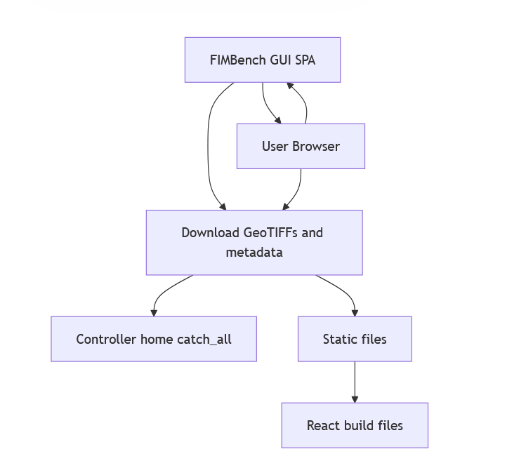

# FIMbench GUI

A React-based single-page application (SPA) for visualizing and downloading **Flood Inundation Maps (FIMs)**, integrated with the **Tethys Platform** backend. Users explore benchmark FIM datasets hosted in the SDML S3 bucket, browsing raster, vector, and metadata files across four quality tiers and High Water Mark (HWM)–derived maps.

---

## Architecture Overview

<p align="center">
  
</p>

This is a Tethys Platform 4 (Django-based) backend serving a React/TypeScript SPA built with Vite. The backend exposes two controllers: a catch-all route that renders the SPA shell, and a tile-proxy endpoint that forwards gzip-compressed Mapbox Vector Tiles from MinIO (or, eventually, S3) to the browser. There is no database, no user auth, and no ORM — the app is a read-only visualization layer over the FIMbench catalog.

---

## Current Status

This is pre-release software developed for CIROH. A few things worth knowing:

1. **Data access currently requires a local MinIO mirror.** The React client fetches the FIM catalog and vector tiles from MinIO on port 9000, and downloads GeoTIFF / metadata JSON via direct MinIO URLs. This workaround is in place because the SDML S3 bucket has not yet had a public-read CORS policy applied. Once that CORS policy goes live, the MinIO dependency will be retired and the client will talk to S3 directly.
2. **Return Period filter is UI-only.** The 100-year / 500-year dropdown renders in the sidebar but has not yet been wired into the filter pipeline.
3. **Dateless records always pass the date filter.** Tier 4 (FEMA BLE synthetic) records in the catalog currently have no date metadata, so they bypass the date-range filter regardless of the selected window. A deliberate behavior for these records is pending.

---

## Features

### Map

- MapLibre GL renderer with a **centroid ↔ extent crossfade** between zoom levels 7 and 8 (tier-colored points at low zoom, dark-blue extent polygons at high zoom)
- Basemap switching: **Street**, **Topographic**, **Satellite** (ESRI sources)
- Vector tiles proxied through Tethys to preserve the upstream gzip encoding end-to-end

### Filters (left sidebar)

- **FIM Tier** — multi-select checkboxes for Tier 1–4 and High Water Mark (HWM)
- **HUC8 ID** — free-text input; when set, state and date filters become inactive (per spec)
- **State** — dropdown multi-select showing full names with abbreviations, e.g. "Iowa (IA)". Catalog records that list multiple states (e.g. `"IA, MN, WI"`) are included whenever *any* of those are selected.
- **Date Range** — start / end date pickers with:
  - Strict `YYYY-MM-DD` parsing (regex-gated; lenient or ambiguous inputs are rejected)
  - Auto-adjust to preserve a minimum one-day window (changing start auto-advances end if needed; changing end pulls start back)
  - Empty or invalid bounds are treated as unconstrained on that side
- **Return Period** — 100-year / 500-year dropdown *(UI present; filter logic pending)*
- **Reset Filters** button — restores defaults

### Table (FIMTable)

- Paginated (20 rows per page), sortable by any column (river/basin, state, year, date, resolution, HUC8, quality, platform)
- Record count reflects what the current filters + map view allow
- Clicking a row selects that FIM on the map; clicking a feature on the map navigates the table to the correct page and scrolls to the row
- Direct download links for the flood inundation raster (`.tif`) and metadata (`.json`)
- "Clear Selection" button in the table header

### Selection styling

- Clicking a centroid, extent polygon, or table row highlights that FIM (tier color preserved, slightly larger, full opacity)
- All non-selected features fade to a desaturated gray with reduced opacity on both the centroid and extent layers
- Selection state survives basemap switches

---

## Filter Interaction Rules

Supported combinations, per the original specification:

| Combination | Notes |
|---|---|
| HUC8 + Tier | When HUC8 is set, state and date filters are bypassed |
| HUC8 + Tier + Return Period | *(Return Period filter not yet wired)* |
| Tier + State | |
| Tier + State + Date Range | |
| Tier + State + Date Range + Return Period | *(Return Period filter not yet wired)* |

**HUC-based filtering is treated as logically separate from state/date filtering.** A record is included in HUC mode when its catalog `huc8` list contains the entered ID; in state/date mode, state membership uses overlap matching and date membership uses range-overlap semantics.

---

## FIMbench Data

Benchmark FIMs are drawn from the SDML bucket and include:

- **Tier 1:** Very high-resolution NOAA imagery (20–50 cm)
- **Tier 2:** PlanetScope + hydrologically guided algorithm (3–5 m)
- **Tier 3:** Sentinel-1A + gap-filled algorithm (10 m)
- **Tier 4:** FEMA Base Level Engineering synthetic events (10 m)
- **HWM FIM:** High Water Mark–derived maps (10 m)

Each dataset folder contains:

- Flood inundation raster (`.tif`)
- Flood domain bounding box (`.gpkg`)
- Metadata (`.json`)

A top-level `catalog_core.json` index enumerates every record with its tier, centroid, bounding box, state(s), HUC8 list, dates, and S3 paths.

---

## Prerequisites

This application runs on:

- **Tethys Platform 4** (Django-based), installed into a conda environment using the libmamba solver
- **Node.js** (current LTS) and **Vite** for the React / TypeScript frontend
- **MapLibre GL** for map rendering
- **S3-compatible object storage** for data access — currently a local **MinIO** instance on port 9000 mirroring the SDML bucket; will migrate to direct S3 once the upstream CORS policy is applied

---

## Project Structure

```
tethysapp-fimbench_gui/
├── reactapp/                        # Vite + React/TypeScript frontend
│   ├── src/
│   │   ├── App.tsx                  # Root component, top-level filter state
│   │   ├── main.tsx
│   │   └── types/catalog.ts
│   └── components/
│       ├── FilterSidebar.tsx        # All filters + reset action
│       ├── Map.tsx                  # MapLibre setup, filtering, selection styling
│       └── FIMTable.tsx             # Sortable, paginated record table
└── tethysapp/fimbench_gui/
    ├── app.py                       # TethysAppBase config + custom settings
    ├── controllers.py               # home() + tile_proxy()
    ├── scripts/                     # Catalog + tile generation utilities
    ├── templates/fimbench_gui/
    └── public/frontend/             # Vite build output (generated)
```

---

## Roadmap

Upcoming work, in rough priority order:

1. **S3 CORS cutover** — retire the local MinIO dependency once the upstream bucket is configured
2. **Return Period filter** — wire the existing UI into the map/table pipeline
3. **HUC8 input validation** — format-gate the input (exactly 8 digits) with inline feedback
4. **Dateless-record policy** — define and implement explicit behavior for records with no date metadata (Tier 4)

---

## Contact

For questions on **FIMbench** (data, methodology, access requests):

- [Dr. Sagy Cohen](mailto:sagy.cohen@ua.edu)
- [Dr. Anupal Baruah](mailto:abaruah@ua.edu)
- [Supath Dhital](mailto:sdhital@crimson.ua.edu)
- [Dipsikha Devi](mailto:ddevi@ua.edu)

For questions about how **this web application** works:

- [Reshma Raghavan](mailto:rraghavan@aquaveo.com)
